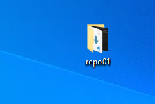

# REPO 01
Primero que todo creamos un reposito llamado "repo01"
ejecutando el comando "git init"

# Entrada al Staging Area

Una vez creamos el documento  readme.md, lo añadimos al staging area usando el comando "git add ."
Una vez añadido visualizamos el estado actual con "git status"

Como podemos visualizar vemos todas las modificaciones realizadas,
donde se borraron y añadieron archivos.

# COMMIT
Realizamos un snapshot(commit) con el comando "git commit -m"
guardando los cambios en el repositorio local en este caso "Repo01"
